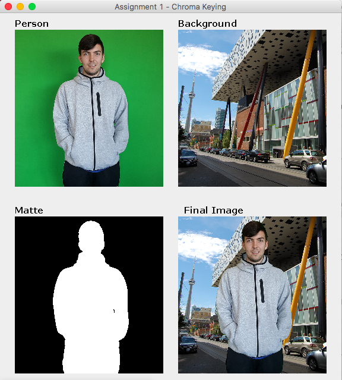

# IAT455-ChromaKeying

Create a composite image of yourself and a famous place of your choice. Start with an image of yourself, taken on a background containing a limited range of hue. Write code to extract a matte from this image using the ‘Keyingbased on chrominance’ method. Then, using the matte, produce the composite of yourself and the famous place.

Output from your code should show:
* original image, captured by camera, with background of limited range of hues
* image of famous place that you will use in your composite
* the matte image obtained through the ‘Keying based on chrominance’ method
* intermediate images (if there are any)
* final composite result

Example Output:

The code should have explanatory comments and should be submitted in zip format, as project
exported from Eclipse. Name your project in this format: FirstnameLastNameA1 (for example:
JohnSmithA1).

Additionally, submit a report in which you explain your process step by step and the challenges or
difficulties you have encountered. Analyze your final composite and explain any artifacts that are
present (areas of incorrect color, transparency, etc).
